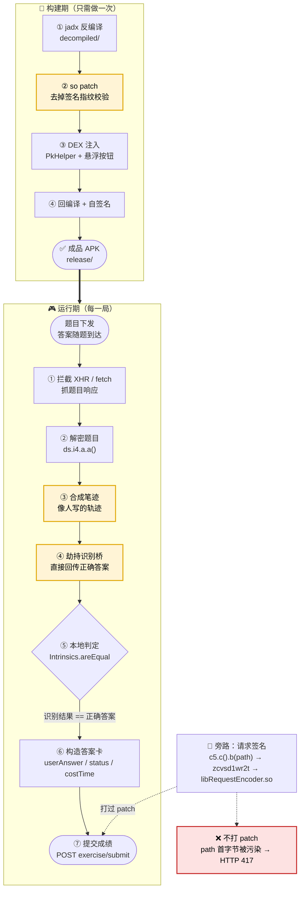
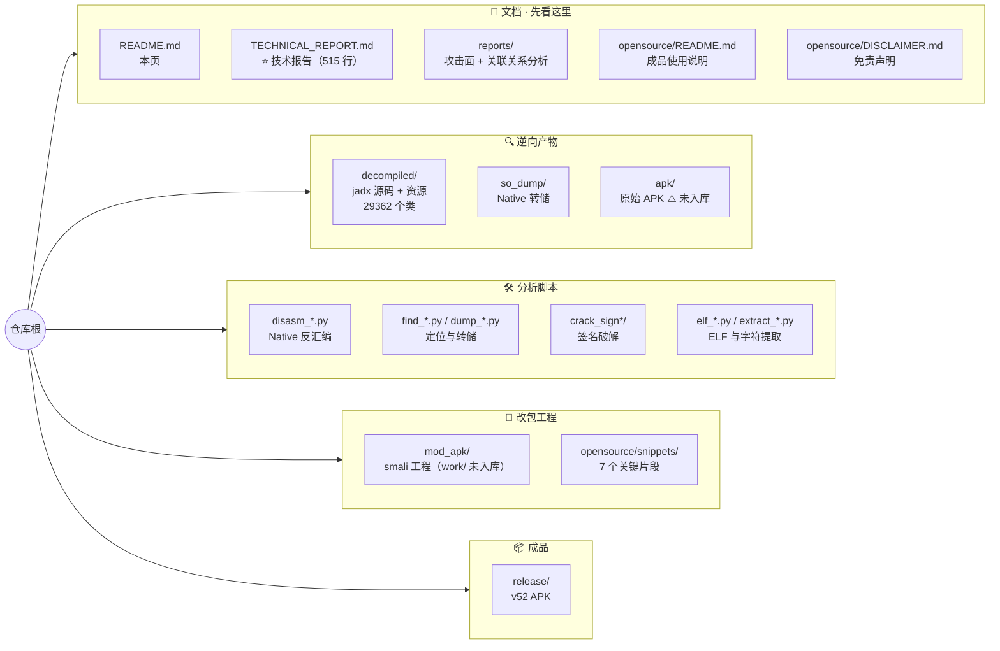
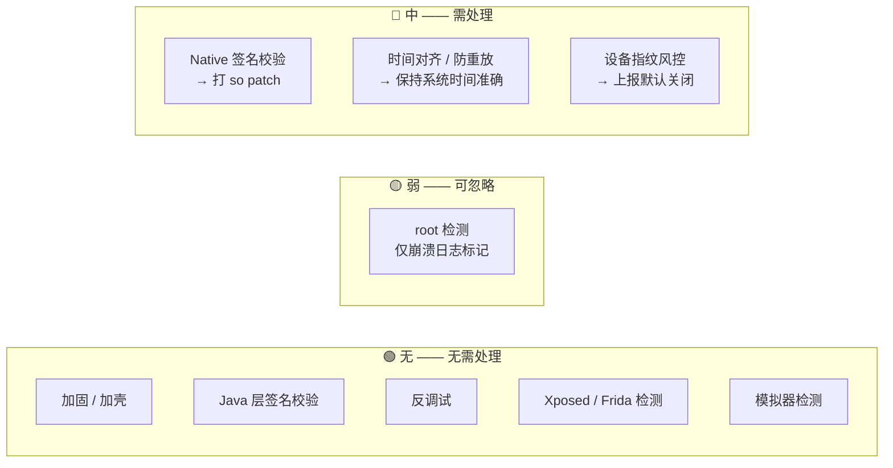

# 小猿口算 PK 自动答题 —— 逆向工程仓库

> 目标应用：`com.fenbi.android.leo`（v52 / 3.141.1）
> 完整逆向产物：反编译源码、Native 分析脚本、改包工程、成品 APK 与技术报告。

---

## 🚀 只想用效果？直接装改版 APK

**不想研究原理、只想拿到成品** —— 直接下载安装：

### [`release/xiaoyuan-kousuan-1s-answer-v52.apk`](release/xiaoyuan-kousuan-1s-answer-v52.apk)（约 82 MB）

```bash
adb uninstall com.fenbi.android.leo      # 先卸载官方版（签名不同，无法覆盖安装）
adb install -r release/xiaoyuan-kousuan-1s-answer-v52.apk
```

装完必读三条：

1. **必须用「短信验证码」登录**（一键登录 / QQ / 微信会因改包签名被服务端拒绝）
2. **进入对局页之前**先点悬浮按钮开启（先进对局再点，题目已加载完，不会触发）
3. 打完一局有**约 60 秒匹配冷却**，这是服务端硬限制

→ 完整使用说明见 [`opensource/README.md`](opensource/README.md)
→ 想搞懂原理自己复刻？直奔 **[`TECHNICAL_REPORT.md`](TECHNICAL_REPORT.md)**

---

## 一句话原理

**判题在客户端本地完成**：题目下发时正确答案已随题目一起到达，客户端只做「识别出的字符串」与「正确答案」的精确相等比对，无服务端二次判题。所以不需要骗过服务端，只需让"识别结果"等于"正确答案"。

---

## 实现原理图



> 🟡 **高亮的三步是成败关键**：so patch（否则 417）、笔迹合成（否则风控清零）、识别桥劫持（否则拿不到分）。

---

## 资产目录结构图



> ⚠️ `decompiled/`、`apk/`、`mitmconf/`、`mod_apk/work/` 被 `.gitignore` 排除，不入版本库；反编译产物已单独打包为 zip 分发，仓库内不可见。

---

## 反外挂强度速览



逐项证据见 [`TECHNICAL_REPORT.md`](TECHNICAL_REPORT.md) 第 1 节。

---

## 声明

本项目为**安全研究与教育用途**的逆向工程笔记。PK 对局中有真人玩家，自动化会直接损害他人体验，请勿用于线上对局。

完整声明见 [`opensource/DISCLAIMER.md`](opensource/DISCLAIMER.md)。
