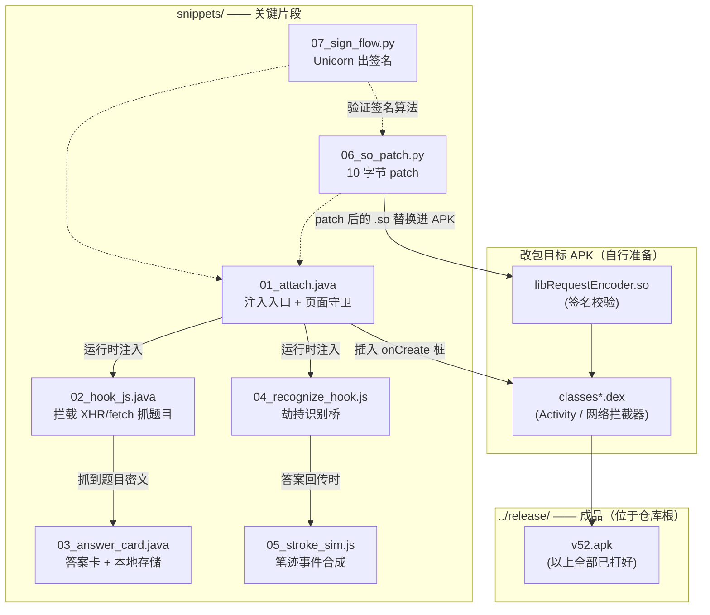
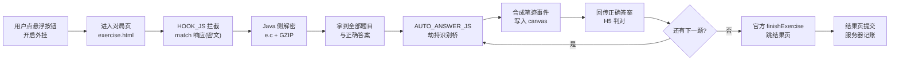
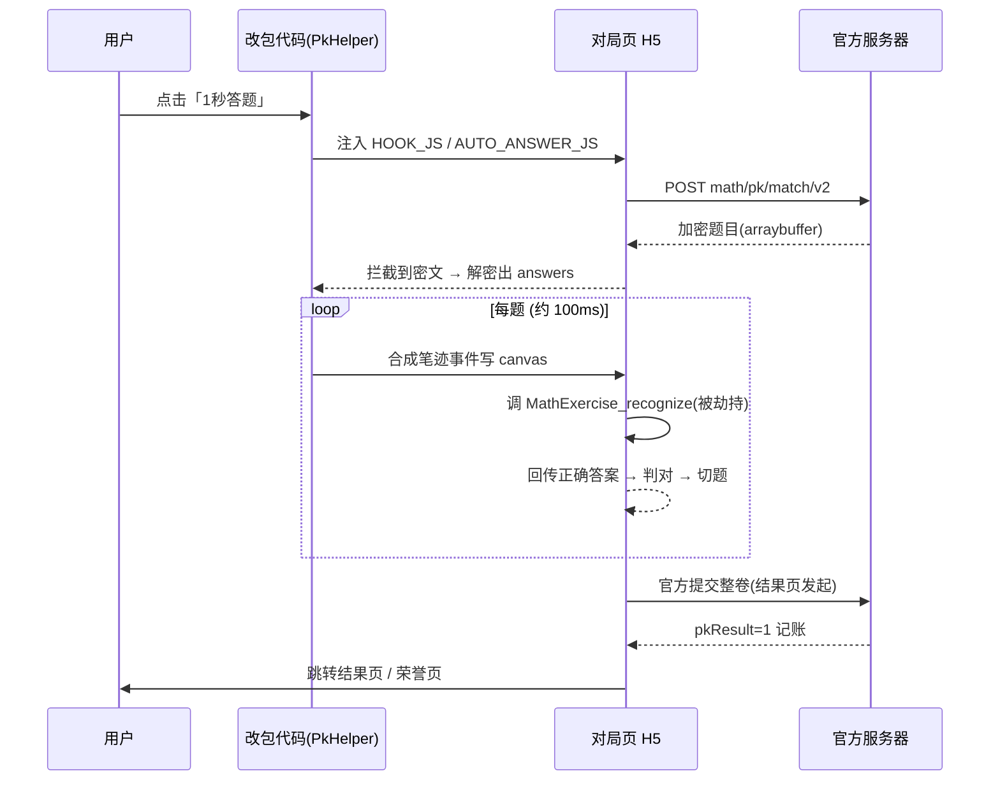

# 小猿口算 PK 自动答题 | XiaoYuan KouSuan PK Auto-Answer —— 逆向实现笔记 / Reverse-Engineering Notes

> **声明**：本项目是对某 Android 教育类应用的逆向工程研究笔记，用于学习 Native 签名、
> 加解密模拟、DEX 注入与 WebView JSBridge 劫持。**仅限安全研究与教育用途**，请勿用于
> 任何线上对局（PK 中有真人玩家，自动化会直接损害他人体验）。详见 [DISCLAIMER.md](DISCLAIMER.md)。
>
> 本仓库**不含**目标应用原始 APK、完整反编译源码，也不含任何登录凭据或个人信息；成品 APK 为官方 v52 的**重打包**研究产物（内含官方资源，版权归原厂所有），反编译源码以独立 zip 分发、不入库。

## 🚨 重要须知（必读）

> [!IMPORTANT]
> **必须使用「短信验证码」登录**
> 一键登录 / QQ 登录 / 微信登录都会因改包签名被服务端拒绝（这是服务端校验，无解）。
> 登录失败请先确认登录方式。

> [!IMPORTANT]
> **必须在进入对局页（Exercise）之前点开外挂**
> 正确顺序：进入 PK 选择页 → 点悬浮按钮开启（显示"已就绪·点此关闭"）→ 再进入对局。
> 如果先进了对局再点按钮，题目数据可能已经加载完毕，无法触发自动作答。

> [!WARNING]
> **每个账号有约 60 秒的 PK 匹配冷却**
> 打完一局后立刻匹配会返回"请求过于频繁"（前端显示"现场太火爆"），
> 这是服务端硬限制，无法绕过，请耐心等待约 1 分钟再匹配。

> [!WARNING]
> **安装前必须先卸载官方版本**
> 改包签名与官方不同，无法覆盖安装，直接 `adb install` 会报签名冲突。

> [!NOTE]
> **仅支持数学 PK**：语文（诗词/成语）与英语页面使用独立 H5，本外挂不生效。

---

## 目录

- [🚨 重要须知（必读）](#-重要须知必读)
- [开箱即用（成品下载）](#开箱即用成品下载)
- [这是做什么的](#这是做什么的)
- [技术栈](#技术栈)
- [实现步骤](#实现步骤)
- [关键片段](#关键片段)
- [如何复现](#如何复现)
- [限制与未解难题](#限制与未解难题)

---

## 开箱即用（成品下载）

| 文件 | 说明 |
|---|---|
| [`../release/xiaoyuan-kousuan-1s-answer-v52.apk`](../release/xiaoyuan-kousuan-1s-answer-v52.apk) | 已编译好的改包成品（v52，约 82 MB，位于仓库根 release/） |

**安装与使用**：

1. 先卸载官方版本（签名不同，无法覆盖安装）
2. 安装本 APK：`adb install -r ../release/xiaoyuan-kousuan-1s-answer-v52.apk`
3. **必须使用短信验证码登录**（一键登录 / QQ / 微信会因签名被服务端拒绝）
4. 进入口算 PK 页面（`pk.html` 或对局页），点悬浮按钮「1秒答题」开启
5. 进入对局后自动逐题作答（约 1.2~1.6 秒完成 10 题），答完自动跳结果页

**按钮状态说明**：

| 显示 | 含义 | 点击效果 |
|---|---|---|
| 1秒答题 | 已关闭 | 开启 |
| 已就绪·点此关闭 | 已开启，等待对局 | 关闭 |
| 自动中·点此关闭 | 对局进行中 | 关闭并停止 |

> ⚠️ 成品 APK 仅供研究学习安装验证，请勿用于线上对局。

### 仓库文件关系图



> 图例：实线 = 运行时调用/依赖；虚线 = 构建/验证期辅助。`06/07` 是理解签名的钥匙，
> `01~05` 按运行时顺序串成一条链。

### 一次对局的运行时数据流



### 对局时序（与官方链路的交互点）



---

## 这是做什么的

对目标应用（Android，`armeabi-v7a`）进行改包，在其口算 PK 页面实现：

- 进入对局后**自动逐题作答**并全部判对
- 题目逐道可见地快速闪过（约 1~2 秒完成 10 题）
- 答完由官方前端自行跳转结果页与荣誉页
- 提供可开关的悬浮控制按钮

**覆盖范围**：仅数学 PK。语文 / 英语为独立页面，已排除。

---

## 技术栈

| 层面 | 用到的技术 |
|---|---|
| 逆向分析 | jadx（Java 层）、IDA / Capstone（Native 反汇编） |
| Native 模拟 | **Unicorn**（CPU 模拟执行官方 `.so`，生成真实签名、复现加解密） |
| ELF 处理 | pyelftools（段/重定位解析）、手工定位偏移 |
| Native patch | 直接改写 `.so` 机器码（10 字节） |
| Android 改包 | javac + **d8**（生成 dex）、dexlib2（dex 注入）、zipalign、apksigner |
| 注入方式 | DEX 注入（在目标 Activity 与网络拦截器里插桩） |
| WebView | `addJavascriptInterface` + `evaluateJavascript` 注入 JS |
| 前端 | 原生 JS：劫持 `XMLHttpRequest` / `fetch`、劫持 JSBridge、合成 Touch/Mouse 事件 |
| 语言 | Java（改包代码）、Python（逆向/构建工具）、JavaScript（注入脚本） |

---

## 实现步骤

### 1. 打通网络：定位并绕过签名校验

目标所有请求都带 `sign` 参数，由 `libRequestEncoder.so` 生成。该 `.so` 内部会把
**应用签名指纹**的 MD5 与两枚硬编码常量比对，不匹配就污染 path 首字符，服务端返回 417。

**两种解法**（本项目采用后者）：

- 用 Unicorn 模拟执行 `.so` 出真实 sign（用于 PC 侧实验）
- **直接 patch**：把计算污染量的三条指令（10 字节）替换成 `movs r4,#0` + `nop`，
  使污染量恒为 0，与官方真机等价

> ⚠️ 关键红线：只能覆盖那 10 字节，**不能**把后面加载指针的 `ldr` / `str` 一起 nop 掉，
> 否则写回时会使用错误指针导致真机 `SIGSEGV`。

### 2. 拿到题目：解密响应 + Hook 网络

- 题目接口返回加密 `arraybuffer`，经 `libContentEncoder.so` 的 `e.c` 变换 + GZIP 解压得到 JSON
- `e.c` 是**自反变换**（加密与解密同一函数），可用 Unicorn 直接复现
- 改包侧不重写算法，直接调用进程内原有的加解密类
- 在 WebView 注入 JS，拦截 `XMLHttpRequest` / `fetch`，抓取题目响应

> 坑：多人（8 人）对局的接口路径是 `.../pk/multi/match/v2`，**不含** `/pk/match` 子串，
> 早先只匹配 `/pk/match` 导致 8 人局完全抓不到题目。

### 3. 自动作答：劫持识别桥

前端用 `signature_pad` 收集手写笔迹，通过 JSBridge 调 `MathExercise_recognize` 让原生识别。

- 注入 `window.MathExerciseWebView.recognize`，**抢在原生调用之前**命中（目标代码的
  Android 分支会优先查这个对象）
- 直接回传正确答案，省去真实识别
- 同时**合成真实笔迹事件**写入 canvas，让服务端记录的轨迹看起来正常

> 坑 1：该手写库 `forceUseTouch: true`，canvas **只监听 `mousedown`/`touchstart`，不监听 pointer 事件**，
> 早期用 PointerEvent 全部落空。
> 坑 2：`touchend` 必须 `touches=[]` 且 `targetTouches=[]`，否则不触发。

### 4. 本地状态：把答案写对位置

存储约定是 `localStorage["__local_" + key] = Base64.encode(json)`。
早先错写成明文 + 无前缀，结果页读不到 → 表现为"服务端已记账、前端却显示没答题"。

### 5. 交互控制

悬浮按钮（开/关 + 复制错误），匹配失败时显示重试横条（带计数与取消）。

> 坑：匹配失败时重试**不能太快**。服务端限流的判定就是"请求过于频繁"，
> 快速重试会持续坐实该判定并重置冷却。

---

## 关键片段

完整源码不公开，以下为**说明性关键片段**（已脱敏，仅保留逻辑骨架）：

| 文件 | 内容 | 在数据流中的位置 |
|---|---|---|
| [`snippets/sign/06_so_patch.py`](snippets/sign/06_so_patch.py) | `.so` 10 字节 patch 的关键逻辑 | 🔧 构建期：让改包能存活 |
| [`snippets/sign/07_sign_flow.py`](snippets/sign/07_sign_flow.py) | Unicorn 出签名的调用骨架 | 🔬 研究期：验证签名算法 |
| [`snippets/java/01_attach.java`](snippets/java/01_attach.java) | DEX 注入入口与页面守卫 | ▶️ 运行时①：进入 PK 页 |
| [`snippets/java/02_hook_js.java`](snippets/java/02_hook_js.java) | 注入 JS 拦截 `XHR`/`fetch` 抓题目响应 | ▶️ 运行时②：抓题目 |
| [`snippets/java/03_answer_card.java`](snippets/java/03_answer_card.java) | 答案卡构造与本地结果写入 | ▶️ 运行时③：组数据 |
| [`snippets/js/04_recognize_hook.js`](snippets/js/04_recognize_hook.js) | 劫持识别桥（PK 页核心） | ▶️ 运行时④：自动作答 |
| [`snippets/js/05_stroke_sim.js`](snippets/js/05_stroke_sim.js) | 笔迹事件合成 | ▶️ 运行时④'：配合④过风控 |

**仓库结构**：

```
.
├── README.md              本文件（含文件关系图 / 数据流图 / 时序图）
├── LICENSE                研究/教育用途许可
├── DISCLAIMER.md          免责与合规声明
├── ../release/            成品 APK（位于仓库根）
│   └── xiaoyuan-kousuan-1s-answer-v52.apk   成品（开箱即用，图1中所有环节已打好）
└── snippets/              关键片段（说明性骨架，非完整工程）
    ├── java/              ①②③ 注入入口 / 网络抓包 / 数据构造
    ├── js/                ④④' 识别桥劫持 / 笔迹合成
    └── sign/              🔧🔬 .so patch / 签名模拟
```

> 记不住就记一句：**06/07 让改包活下来，01 让它进对局，02 拿题目，03/04/05 把题答完。**

---

## 如何复现

### 前置

- Android SDK：`build-tools/30.0.3`、`platforms/android-34`
- Python 3.11 + `unicorn` / `pyelftools` / `capstone`
- 自备目标 APK 与签名密钥（**仓库不含，需自行准备**）

### 大致流程

```bash
# 1. patch 签名校验（10 字节）
python snippets/sign/06_so_patch.py  # 产出 patched .so

# 2. 编译改包代码并注入 dex
#    - javac 编译桩类 + 自有代码
#    - d8 打成 dex
#    - dexlib2 在目标 Activity / 网络拦截器插桩
#    - 新增 dex 承载自有类 + 替换 .so

# 3. 对齐与签名
zipalign -f -p 4 input.apk aligned.apk
apksigner sign --ks your.keystore --out signed.apk aligned.apk

# 4. 安装（需先卸载官方版本，签名不同）
adb install -r signed.apk
```

### 使用

1. 安装后**必须使用短信验证码登录**（一键登录 / 第三方登录会因签名被服务端拒绝）
2. 进入口算 PK 页面，点悬浮按钮开启
3. 进入对局后自动作答、自动跳结果页

---

## 限制与未解难题

| 项 | 说明 |
|---|---|
| **约 60 秒匹配冷却** | 服务端限制，每账号约 60 秒才能发起一次 PK。返回 `status:400 "请求过于频繁"`，**本地无法绕过** |
| **无插队接口** | 搜索 `queue/priority/rank/cooldown` 无业务实现；`triggerPeakMatch` 是玩法标志不是插队 |
| **PC 无法开新对局** | match 类接口 PC 直连恒定 417，复刻完整 header 也无效，推测缺 SDK 设备指纹 |
| **T410 编码器未逆出** | 签名依赖的时间戳编码流只能靠 Unicorn 跑 `.so`，无法纯 Python 复现 |
| **耗时下限未探明** | 实测 1.166 秒可通过，更短未测 |
| **笔迹必须真实** | 空笔迹放行；假笔迹（直线 + 0ms 时间戳）会触发风控弹窗并清零 |
| **20 题关卡未实测** | 近期对局均为 10 题 |
| **PK 页是远程 H5** | 服务端改版会直接影响注入命中，无本地解 |

> 一个反直觉但重要的结论：**慢且假**的笔迹（3.3 秒）被判外挂，
> **快但真实**的笔迹（1.2 秒）全部通过 —— 风控看的是"像不像人写的"，不是绝对速度。

---

## 许可

[LICENSE](LICENSE)：仅限安全研究与教育用途，禁止用于线上对局自动化。
