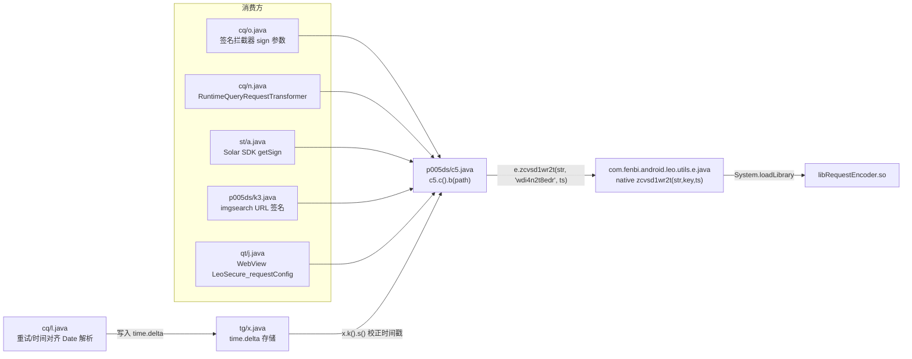
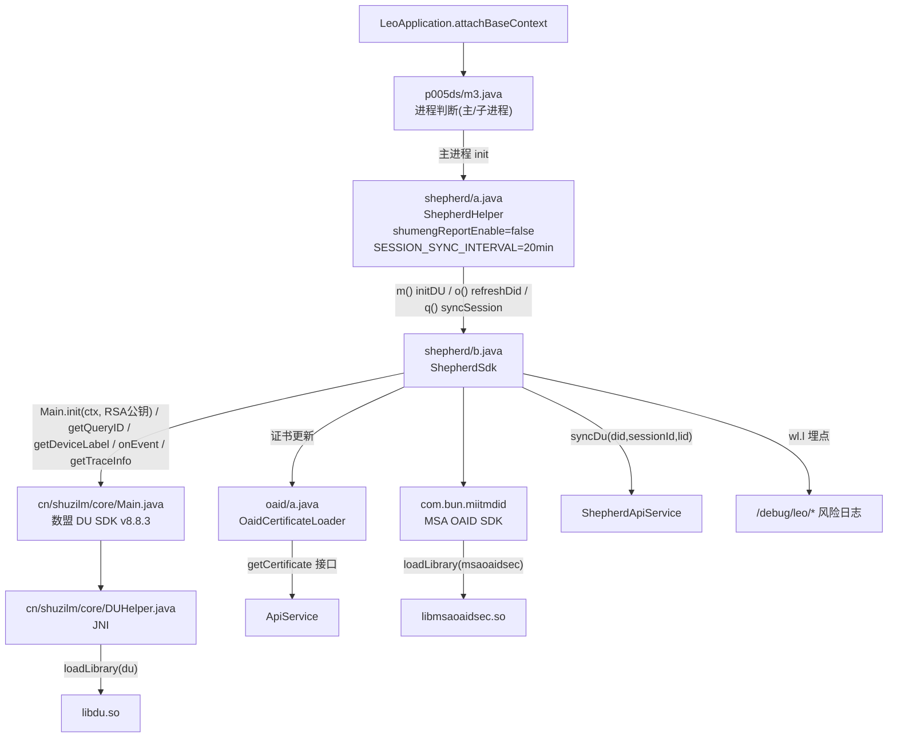
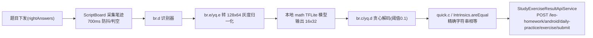

# 小猿口算 APK 静态分析报告 — 模块结构与文件关联关系图

> 📍 注：文中 `decompiled/...` 路径为坐标参考，该目录不入仓库（以 zip 分发）；原本地绝对路径链接已转为纯文本坐标。

> 目标：`com.fenbi.android.leo`（29362 个反编译类）
> 范围：com.fenbi（业务）+ com.yuanfudao（安全/风控）+ 三方 SDK
> 反编译：jadx 1.5.6；产物根目录 `decompiled/sources/sources/`

***

## 0. 结论速览（TL;DR）

| 检测维度            | Java 层结论                                          | Native 层结论                                                     | 强度    |
| --------------- | ------------------------------------------------- | -------------------------------------------------------------- | ----- |
| 加固/加壳           | 无（`Application` 直挂 `LeoApplication`）              | 无壳                                                             | 无     |
| root/su 检测      | 仅 `gc0/g.java`(CrashUtil) 静态扫 su 路径，用于崩溃墓碑标记，非拦截  | 未见自研检测字符串                                                      | 弱     |
| Xposed/Frida 检测 | 无                                                 | 仅 MSA OAID 三方库 `libmsaoaidsec.so` 含 `ptrace`/`/proc/self/maps` | 弱（三方） |
| 反调试             | 无（`TracerPid`/`isDebuggerConnected`/`ptrace` 零命中） | 同上，MSA 库                                                       | 弱     |
| 签名/完整性校验        | 无（`getPackageInfo`/`signature` 零命中）               | `libmsaoaidsec.so`(OAID 证书校验)                                  | 弱     |
| 模拟器检测           | 无（qemu/goldfish 等零命中，1 处为 OAID 证书加载器误报）           | 未见                                                             | 无     |
| 网络请求签名          | `p005ds/c5` + native `RequestEncoder`             | `libRequestEncoder.so::zcvsd1wr2t`                             | 中     |
| 网络内容加密          | `ContentEncoder`（图像搜索）                            | `libContentEncoder.so`                                         | 中     |
| 设备指纹/风控         | Shepherd + 数盟 DU + MSA OAID                       | `libdu.so`                                                     | 中     |

**核心判断：小猿口算的反外挂强度整体偏弱。** 没有应用自研的 Java 层 root/Xposed/Frida/模拟器/反调试/签名校验，也没有加壳。真正的"防护"集中在两块：① 请求签名（native）+ 时间对齐防重放；② 设备指纹风控（数盟 + OAID），且数盟上报开关默认关闭（`shumengReportEnable = false`）。判题本身是**本地**完成的（见外挂方案）。

***

## 1. 顶层包结构

```
com.fenbi.android.leo/       ← 业务主包（UI、网络、判题、题目）
com.yuanfudao.android.leo/   ← 安全/风控/图像/答题（关键逆向对象）
cn.shuzilm.core/             ← 数盟 DU 设备指纹 SDK（v8.8.3）
com.bun.miitmdid/            ← MSA OAID SDK（移动安全联盟）
p005ds/                      ← 混淆工具类（含请求签名 c5、进程判断 m3）
cq/                          ← okhttp 拦截器（签名 o、运行时参数 n、重试 l）
st/                          ← Solar SDK 初始化
gc0/                         ← CrashUtil（唯一 Java root 扫描）
```

***

## 2. 文件关联关系图（Mermaid）

### 2.1 请求签名 / 网络层



* 签名密钥：`"wdi4n2t8edr"`（p005ds/c5.java:L52）

* 时间戳：`(int)(x.k().s() / 1000)`，`x.k().s()` 是被 HTTP `Date` 头修正后的设备时间（防重放）。

* native 入口：`native String zcvsd1wr2t(String str, String str2, int i11)`（com/fenbi/android/leo/utils/e.java）

### 2.2 设备指纹 / 风控层



* RSA 公钥（数盟 init）：`MFwwDQYJKoZIhvcNAQEBBQADSwAwSAJBALpE39G2Lbe56BqwGGzFoh1c8YcSrZhw+VDoWikrN3J1f0yN22+wRwVDVUhO7DjsE6XCgg7h7qDazJvBDvo6/b0CAwEAAQ==`（com/yuanfudao/android/leo/shepherd/b.java）

* 风控日志端点（`wl.l.f80804a.j(...)` / `wl.e.a().log(...)`）：

  * `/debug/leo/getDidFailed`、`/debug/leo/getDidSuccess`、`/debug/leo/didChanged`

  * `/debug/leo/getDidFailed/trace`、`/debug/leo/startSyncSessionId`、`/debug/leo/getSessionIdSuccess`

  * `/debug/leo/syncSessionIdTimeOut`、`/debug/leo/syncDidTimeOut`

  * `/debug/leo/abnormalTimeDelta`（时间异常）、`/debug/retryInterceptor/request401`（401 重试）

### 2.3 判题 / 成绩提交层（本地判定）



* 提交接口：

  * `POST /leo-homework/android/daily-practice/exercise/submit`（com/yuanfudao/android/leo/study/exercise/result/StudyExerciseResultApiService.java:L47）

  * `POST /leo-homework/android/daily-practice/exercise/review/submit`

***

## 3. 反外挂维度逐项证据

### 3.1 加固/加壳 — **无**

* `AndroidManifest.xml`：`<application android:name="com.fenbi.android.leo.LeoApplication">` 直挂业务 Application，无 `StubApp`/代理壳。

* 全局无 `jiagu`/`bangcle`/`secneo`/`Packer`/`libDexHelper`/`libexec` 特征。

* `com/yuanfudao` 内 `orion` 命中的是业务模块（`orion/api/BaseOrionData`、`redress/OrionEdgeColorConfig`），非加固。

### 3.2 root/su 检测 — **弱，仅崩溃标记**

* 唯一命中：gc0/g.java 的 `g()` 扫描 11 个 su 路径，但仅用于 CrashUtil 崩溃墓碑写入 `Rooted: Yes/No`，不触发拦截/退出。

### 3.3 Xposed/Frida — **Java 无、Native 仅三方**

* 全局 grep `xposed/frida/magisk/XposedBridge/...`：仅支付宝（su 路径）、腾讯 MID（su）、material、Google ML Kit（SU 语言码）等三方/误报。

* native：`libmsaoaidsec.so` 含 `ptrace`、`/proc/self/maps`（MSA OAID 安全库标准行为，非应用自研）。

### 3.4 反调试 — **无**

* `com/yuanfudao` 内 `TracerPid|isDebuggerConnected|Debug.isDebugger|ptrace|/proc/self/status` **零命中**。

* 全局命中仅为 WebRTC/GoogleSignatureVerifier/LeakCanary/KOOM/Sentry 三方库。

### 3.5 签名/完整性校验 — **无应用级校验**

* `com/yuanfudao` 内 `getPackageInfo|GET_SIGNING_CERTIFICATES|GET_SIGNATURES|signature` **零命中**。

* 仅存在的"证书"是 MSA OAID 的证书加载器（`oaid/a.java`，证书内容见 `DEFAULT_PUBLIC_KEY`），用于 OAID 鉴权，非 APK 完整性校验。

### 3.6 模拟器检测 — **无**

* `com/yuanfudao` 内 qemu/goldfish/ranchu/genymotion 等 **零命中**（唯一 1 处是 `oaid/a.java` 证书 base64 误报）。

### 3.7 Native 库清单（关键安全相关）

| 库                      | 归属       | 用途            | 反外挂相关             |
| ---------------------- | -------- | ------------- | ----------------- |
| `libRequestEncoder.so` | 自研       | 请求签名 native   | 签名算法需逆向           |
| `libContentEncoder.so` | 自研       | 图像搜索内容编码      | 内容加密              |
| `libdu.so`             | 数盟       | 设备指纹          | 风控                |
| `libmsaoaidsec.so`     | MSA      | OAID 安全       | 含 ptrace/maps（三方） |
| `libmsaoaidauth.so`    | MSA      | OAID 鉴权       | 证书校验（三方）          |
| `libxhook_lib.so`      | 快手 xhook | RheaTrace3 插桩 | 非反外挂              |
| `libRedressProcess.so` | 自研       | 图像矫正/补全       | 非反外挂              |

***

## 4. 待自行验证项

1. `libRequestEncoder.so::zcvsd1wr2t` 的**具体签名算法**（疑似 MD5/HMAC，需 IDA/Ghidra 反汇编确认，或直接 JNI 调用绕过）。
2. `libdu.so` 内部是否含 root/模拟器环境检测字符串（本次 strings 扫描未发现明显命中，但数盟 SDK 通常有环境采集逻辑）。

